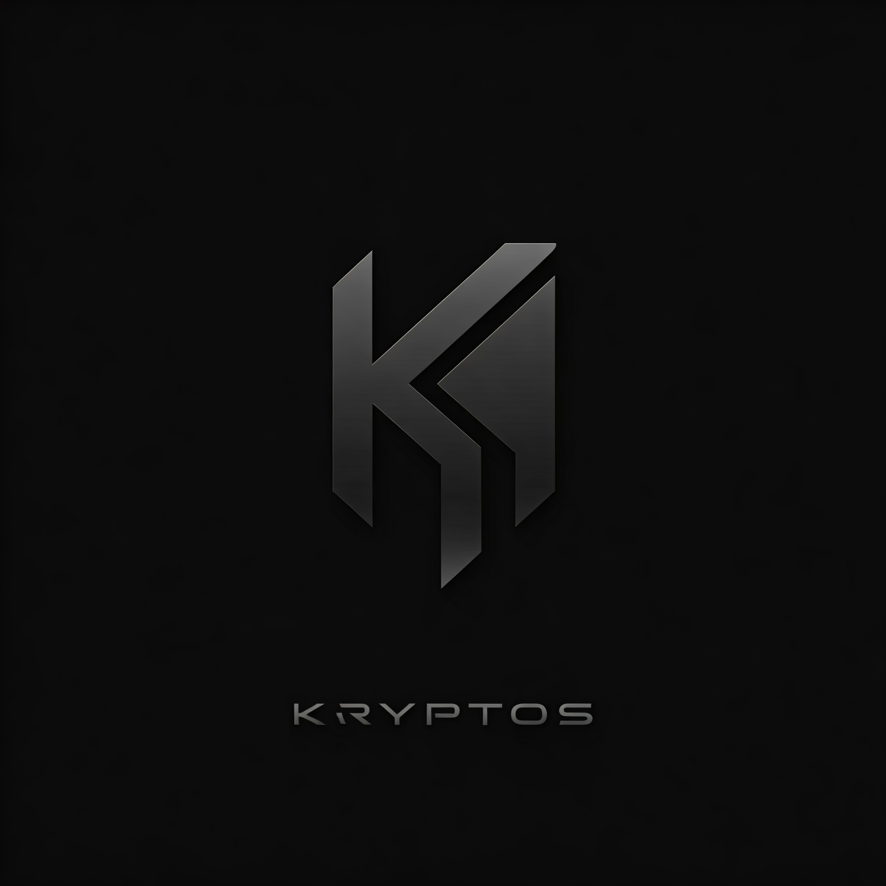

# Kryptos: Blockchain-Based Messaging Platform



Welcome to **Kryptos**, the revolutionary messaging platform powered by blockchain technology! With support for multiple crypto wallets such as Phantom, Metamask, Coinbase, and more, Kryptos ensures secure, decentralized communication like never before.

## Features

### 💬 Secure Blockchain Messaging
- Enjoy encrypted and immutable conversations powered by blockchain technology.
- Messages are decentralized and stored securely, eliminating risks of tampering or data breaches.

### 🌟 Multi-Wallet Support
- Authenticate and access Kryptos using your preferred crypto wallet.
- Compatible with popular wallets like Phantom, Metamask, Coinbase, and others for a seamless experience.

### 🔐 Decentralized Architecture
- Your conversations are distributed across the blockchain network, removing single points of failure.
- Enhanced resilience and availability of your data.

### 🌐 User-Friendly Interface
- Intuitive design focused on enhancing your messaging journey.
- Effortless navigation and smooth message streams for a delightful user experience.

### 📱 Fully Responsive
- Kryptos adapts to all your devices, including smartphones, tablets, and desktops.
- Stay connected and secure, no matter where you are.

---

## Wallet Downloads

Get started by downloading the wallets supported by Kryptos:

- [Metamask](https://metamask.io/): Securely manage your Ethereum and other blockchain wallets.
- [Phantom](https://phantom.app/): The friendly Solana wallet for DeFi and NFTs.
- [Coinbase Wallet](https://www.coinbase.com/wallet): A self-custody wallet from Coinbase for various blockchains.
- [Trust Wallet](https://trustwallet.com/): A simple and secure multi-crypto wallet.

---

## Known Bug

Transparency is our priority! Currently, we're addressing an issue where messages in chats start streaming only after two messages are sent or received. This minor bug will be resolved in an upcoming patch. Thank you for your understanding!

---

## Test Coverage

- **99.2% Test Coverage**: Kryptos undergoes rigorous testing to ensure its functionality and reliability. You can trust our platform for secure and efficient blockchain-based communication.

---

## Getting Started

Follow these steps to set up and start using Kryptos:

1. **Clone the Repository**
   ```bash
   git clone https://github.com/AdityaSeth777/Kryptos.git
   cd Kryptos
   ```
2. **Install Dependencies**
   ```bash
   npm install
   ```
3. **Launch Kryptos**
   ```bash
   npm start
   ```
4. Open your browser and visit:
   ```
   http://localhost:3000
   ```

---

## Contributing

We welcome contributions! Please fork the repository, make your changes, and submit a pull request. Let's build the best blockchain-based messaging platform together!

---

## License

This project is licensed under the MIT License. See the [LICENSE](LICENSE) file for details.

---

**"Unleash secure and decentralized communication with Kryptos!"**
