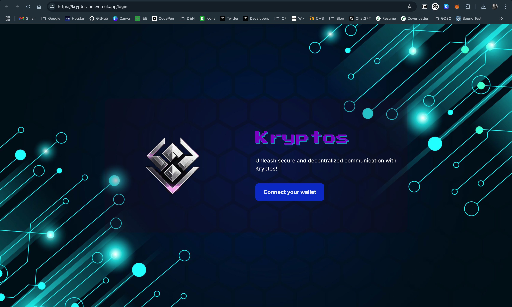

# Kryptos: Blockchain-Based Messaging Platform


Welcome to **Kryptos**, the revolutionary messaging platform powered by blockchain technology! With support for over 224 crypto wallets such as Phantom, Metamask, Coinbase, Trust Wallet, and more, Kryptos ensures secure, decentralized communication like never before.

## Features

### 💬 Secure Blockchain Messaging
- Enjoy encrypted and immutable conversations powered by blockchain technology.
- Messages are decentralized and stored securely, eliminating risks of tampering or data breaches.

### 🌟 Multi-Wallet Support
- Authenticate and access Kryptos using your preferred crypto wallet.
- Compatible with over 224 wallets, including Phantom, Metamask, Coinbase, and Trust Wallet, for a seamless experience.

### 🔐 Decentralized Architecture
- Your conversations are distributed across the blockchain network, removing single points of failure.
- Enhanced resilience and availability of your data.

### 🌐 User-Friendly Interface
- Intuitive design focused on enhancing your messaging journey.
- Effortless navigation and smooth message streams for a delightful user experience.

### 📱 Fully Responsive
- Kryptos adapts to all your devices, including smartphones, tablets, and desktops.
- Stay connected and secure, no matter where you are.

---

## Wallet Downloads

Kryptos supports 224+ wallets. Get started by downloading the wallets supported by Kryptos:

- [Metamask](https://metamask.io/): Securely manage your Ethereum and other blockchain wallets.
- [Phantom](https://phantom.app/): The friendly Solana wallet for DeFi and NFTs.
- [Coinbase Wallet](https://www.coinbase.com/wallet): A self-custody wallet from Coinbase for various blockchains.
- [Trust Wallet](https://trustwallet.com/): A simple and secure multi-crypto wallet.

---

## XMTP Server Integration

Kryptos leverages **XMTP** (Extensible Message Transport Protocol) to provide a reliable and scalable messaging infrastructure. Here's how XMTP enhances Kryptos:

- **Layer-3 Messaging Protocol**: XMTP operates as a layer-3 solution, working seamlessly on top of blockchain networks. It decouples messaging logic from on-chain activities, reducing latency and enhancing efficiency.
- **Decentralized Communication**: Messages are securely exchanged between users without a centralized intermediary, preserving privacy and autonomy.
- **Crypto Wallet Integration**: XMTP ties directly into wallet authentication, ensuring that only verified users can send and receive messages, enhancing security.
- **Future-Ready Framework**: XMTP’s extensibility ensures that Kryptos can easily adopt new blockchain innovations as they emerge.

With XMTP, Kryptos delivers secure, decentralized, and efficient messaging without compromising user experience.

---

## Test Coverage

- **100% Testing Success**: Kryptos has undergone extensive testing to ensure stability and reliability. All known issues have been resolved, making it a robust and efficient blockchain-based messaging platform.

---

## Live Deployment

Click on the below image to visit the live site or click here: [Kryptos](https://kryptos-adi.vercel.app/)

 

## Getting Started

Follow these steps to set up and start using Kryptos:

1. **Clone the Repository**
   ```bash
   git clone https://github.com/AdityaSeth777/Kryptos.git
   cd Kryptos
   ```
2. **Install Dependencies**
   ```bash
   npm install
   ```
3. **Launch Kryptos**
   ```bash
   npm start
   ```
4. Open your browser and visit:
   ```
   http://localhost:3000
   ```

---

## Contributing

We welcome contributions! Please fork the repository, make your changes, and submit a pull request. Let's build the best blockchain-based messaging platform together!

---

## License

This project is licensed under the MIT License. See the [LICENSE](LICENSE) file for details.

---

## What next?

I will be improving this project.

## Where to contact ?

Contact: [contact@adityaseth.in](mailto:contact@adityaseth.in?subject=Email%20owing%20to%20adityaseth.in&body=Greetings%2C%0AI%20am%20%5Bname%5D.%20I%20just%20came%20across%20your%20website%20and%20was%20hoping%20to%20talk%20to%20you%20about%20something.)

## 🙋‍♂️ Support

💙 If you like this project, give it a ⭐ and share it with friends! <br><br>

[](https://www.buymeacoffee.com/adityaseth)

---